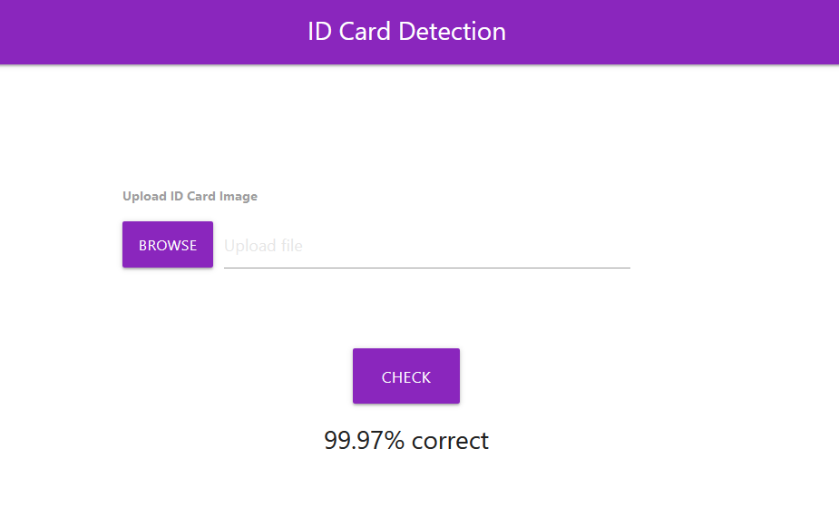

# Installation
- Create the copy of the project.
- Open command prompt and change your current path to folder where you can find 'app.py' file.
- Create environment by command given below-
conda create -name <environment name>
- Activate environment by command as follows- conda activate <environment name>
- Use command below to install required dependencies-
python -m pip install -r requirements.txt
- Run application by command;
python app.py
- You will get url copy it and paste in browser.
- You have sample_data folder where you can get images to test.

# Flowchart

# Project Page

